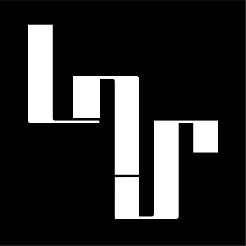

# lainsce.us

A personal site for independent design, development, and local-first tools

###

[](http://www.gnu.org/licenses/gpl-3.0)

## 💝 Donations

Would you like to support the development of this work to new heights?
Then become a GitHub Sponsor or check my Patreon, buttons in the sidebar.

## 🛠️ Dependencies

Please make sure you have these dependencies first before building.
```text
ruby
jekyll
sass
```

## 🏗️ Building

Clone this repo, then build the Jekyll site:
```bash
jekyll build
```

To preview it locally:
```bash
jekyll serve
```

The site configuration lives in `_config.yml` and the generated site is
written to `_site/`.
